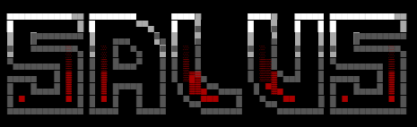

<p align="center">
  <a href="README.md"></a>
  <a href="README.pt-BR.md"></a>
  <a href="README.es.md"></a>
</p>

<p align="center">
  
  
  
  
</p>

<p align="center">
  
</p>

<h1 align="center">Salus</h1>
<p align="center"><strong>Seu especialista em AppSec rodando no terminal.</strong></p>
<p align="center">Code Review · Vulnerability Scanner · Red Team · Blue Team · AI/LLM · Web Security</p>
<p align="center"><sub>Projeto open-source desenvolvido pela <strong><a href="https://github.com/155157171">Oryn Labs</a></strong></sub></p>

---

## Sobre

**Salus** é um CLI de segurança de aplicações com inteligência artificial.  
Ele escaneia seu projeto, envia o contexto estruturado para uma LLM (BYOK — _Bring Your Own Key_),
gera um relatório completo de vulnerabilidades e aplica correções automaticamente
**sem alterar suas regras de negócio**.

Seis motores de análise em uma ferramenta:

| Modo | Comando | Foco |
|------|---------|------|
| **Vulnerability Scanner** | `salus analyze` | OWASP Top 10, CVEs, CVSS 4.0, EPSS, CISA KEV, SBOM + VEX, Reachability |
| **Red Team** | `salus redteam` | Kill chain, MITRE ATT&CK, pontos de injeção, lateral movement, privilege escalation |
| **Blue Team** | `salus harden` | Defense-in-depth, CIS Benchmarks, security headers, rate limiting, hardening cripto |
| **AI/LLM Security** | `salus aisec` | OWASP LLM Top 10 2025, prompt injection, RAG, segurança de agentes/MCP |
| **Web Security** | `salus websec` | OWASP Top 10 2021, SQLi, XSS, SSRF, SSTI, auth bypass, payment bypass |

---

## Instalação

```bash
npm install -g salus-appsec
```

**Pré-requisitos:** Node.js ≥ 20.

---

## Configuração (BYOK)

Salus suporta **3 provedores de LLM** — escolha o seu:

| Provedor | Prefixo | Modelos |
|----------|---------|---------|
| **OpenAI** | `sk-proj-...` | gpt-4o, gpt-4o-mini |
| **Anthropic** | `sk-ant-...` | claude-3-5-sonnet |
| **OpenRouter** | `sk-or-...` | anthropic/claude-3.5-sonnet |

A chave é armazenada em `~/.salus/config.json` com permissões restritas (`0700`/`0600`).

```bash
salus config
```

Suporte a variáveis de ambiente para CI/CD:

```bash
export SALUS_OPENAI_API_KEY="sk-..."
export SALUS_OPENAI_MODEL="gpt-4o"
```

---

## Como usar

### Terminal interativo (REPL)

```bash
salus
```

Isso abre um prompt contínuo onde você pode digitar comandos:

```
salus › /analyze    # varredura de vulnerabilidades
salus › /redteam    # análise ofensiva
salus › /harden     # hardening defensivo
salus › /aisec      # auditoria AI/LLM
salus › /websec     # segurança web/API
salus › /config     # configurar provedor + API Key
salus › /help       # ajuda
salus › /exit       # sair
```

### Comandos diretos

```bash
salus analyze              # Varredura OWASP + CVSS + EPSS + KEV
salus redteam              # Análise Red Team (kill chain, ATT&CK)
salus harden               # Hardening Blue Team (defense-in-depth)
salus aisec                # Auditoria AI/LLM (OWASP LLM Top 10)
salus websec               # Segurança web/API (OWASP, SQLi, XSS, SSRF)
```

### Saída

Cada comando gera um relatório Markdown na raiz do projeto:

```
analyze  →  security-report.md
redteam  →  red-team-report.md
harden   →  defense-hardening-report.md
aisec    →  ai-security-report.md
websec   →  web-security-report.md
```

---

## Features

### Vulnerability Scanner
- **OWASP Top 10** completo com CVSS 4.0/3.1 e vector strings
- **EPSS** (Exploit Prediction Scoring System) + catálogo **CISA KEV**
- **SBOM + VEX** — software bill of materials com statements `affected / not_affected / fixed`
- **Reachability Analysis** — a função vulnerável é realmente chamada?
- Auditoria de dependências (`package.json`, `requirements.txt`, `go.mod`, `pom.xml`, `Cargo.toml`)
- Revisão de config: Nginx, SSH, Docker, Kubernetes com CIS Benchmarks

### Red Team
- **Kill chain** completa (11 fases) com MITRE ATT&CK mapping
- Pontos de injeção, auth bypass, SSRF, RCE, IDOR, race conditions
- Lateral movement, privilege escalation, defense evasion, falhas de OPSEC
- AD attack paths, exploração de cloud/metadata

### Blue Team
- **Defense-in-depth** (6 camadas): perímetro → aplicação → auth → dados → infra → observabilidade
- CIS Benchmarks para Node.js, Nginx, Docker, Kubernetes, PostgreSQL
- Security headers (CSP, HSTS, X-Frame-Options), rate limiting, MFA
- Password hashing (bcrypt/argon2), TLS 1.3, container hardening
- Logging estruturado, audit trail, gerenciamento de secrets

### AI/LLM Security
- **OWASP Top 10 for LLM Applications (2025)** + MITRE ATLAS
- Prompt injection (direto, indireto, encoding, multi-turn, crescendo)
- Segurança de RAG/vector store, agentes e tools (MCP)
- Model supply chain (pickle/safetensors), guardrails & output handling

### Web Security
- **OWASP Top 10 (2021)** — A01 a A10 com mapeamento CWE
- SQL Injection, XSS (por contexto), Command Injection, SSRF, SSTI por engine
- Segurança de API: BOLA/IDOR, mass assignment, GraphQL, ataques JWT
- Bypass de autenticação, falhas de sessão, revisão OAuth/OIDC
- Bypass de pagamento: race conditions, manipulação de preço, abuso de cupons
- CORS/CSP/Security Headers: configurações incorretas

### Auto-Fix Anti-Alucinação
Salus é a **única CLI com motor anti-alucinação dedicado**. Antes de aplicar qualquer correção:
1. Re-lê todo o código-fonte para contexto completo
2. Valida que o código vulnerável existe textualmente no arquivo
3. Classifica cada finding como `FIXED`, `FALSE_POSITIVE` ou `NEEDS_MANUAL_REVIEW`
4. Gera a **menor alteração possível** que elimina a vulnerabilidade
5. Preserva 100% da lógica de negócio, comentários e estilo do código
- Backup automático antes de cada patch (`~/.salus/backups/`)
- Substituição de múltiplas ocorrências (`replaceAll`)
- Validação de schema do output da IA + detecção de padrões perigosos
- Disclaimer pré-fix: ⚠ _FAÇA BACKUP ANTES DO AUTO-FIX_

---

## Segurança do próprio Salus

O Salus foi auditado com... o próprio Salus. Todos os motores de análise foram aplicados
ao código-fonte da ferramenta e as correções foram implementadas:

- Anti prompt-injection em todos os system prompts
- Validação de schema no output da IA
- Redação de secrets em logs e auditoria
- Boundary demarcation (`<CODE_ANALYSIS_BOUNDARY>`) no input da LLM
- Permissões restritas no config (`0700`/`0600`)
- Limites de contexto no scanner
- Tracking de tokens e estimativa de custo

---

## Contribuindo

```bash
git clone https://github.com/155157171/salus-appsec
cd salus-appsec
npm install
npm run build
node dist/index.js
```

---

## Licença

MIT © Salus AppSec
